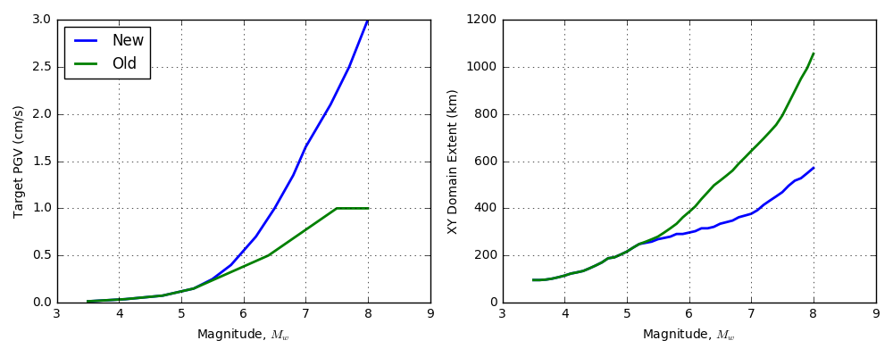

# Custom Models Used in VM Params

There are a couple of functions used in the estimation of the
simulation bounds that are QuakeCoRE specific and have no
reference. These heuristics are developed and tweaked with experience
from simulation output.

## PGV estimation

The function `pgv_estimate_from_magnitude` is used to determine the lateral extents of the VM domain. Robin gives an explanation of the original design of this method:

> We originally used a constant target PGV for Cybershake (I think
> 2cm/s) but I found that this gave Rrup that were too small for
> validation of small Mw (3.5-5) earthquakes. It gave Rrup like 10km,
> which is way too small. I did some heuristic analysis of what kind of
> (Mw-dependent) Rrups would reasonably include most of the high-quality
> ground motions recorded for my dataset of earthquakes. With some (or a
> lot of) subjectivity, I determined some numbers similar to the ones
> you see in that function. Later when I simulated moderate Mw
> earthquakes, I tweaked the numbers for above Mw 5.2 slightly to what
> you see in that function now. Below is a plot of the old numbers based
> on small Mw earthquakes (green) and current numbers (blue).

## Max Depth Estimation

The function `get_max_depth` estimates the maximum depth of the
simulation. The design accounts for the hypocentre depth plus a
correction factor that allows larger earthquake to have deeper
simulations. Quoting Robin:

> The second one was made by Brendon a long time ago to determine Z extent of VM domains. Can't find the original comment so maybe it was in one of the archived Slack channels. It is basically making sure the Z extent of VM domain is deep enough so the bottom does not adversely interfere with waves that initially radiate downwards from the earthquake before refracting towards the ground surface. That is why it is:
>
> 1.    hypocentre\_depth
> 2.    Plus a flat 10km buffer below that hypocentre\_depth
> 3.    Plus an additional nonlinear Mw and hypocentre\_depth term because the relative depth to which waves travel that eventually arrive at the ground surface with significant amplitude increases with Mw (i.e., they take off downwards to deeper depths but still have significant amplitude when they refract and arrive at the ground surface) but is inversely related to hypocentre\_depth (i.e., for same site, weaker shaking will result from a deeper earthquake). 
> At least that's how I interpret it. That double power looks wonky though.
