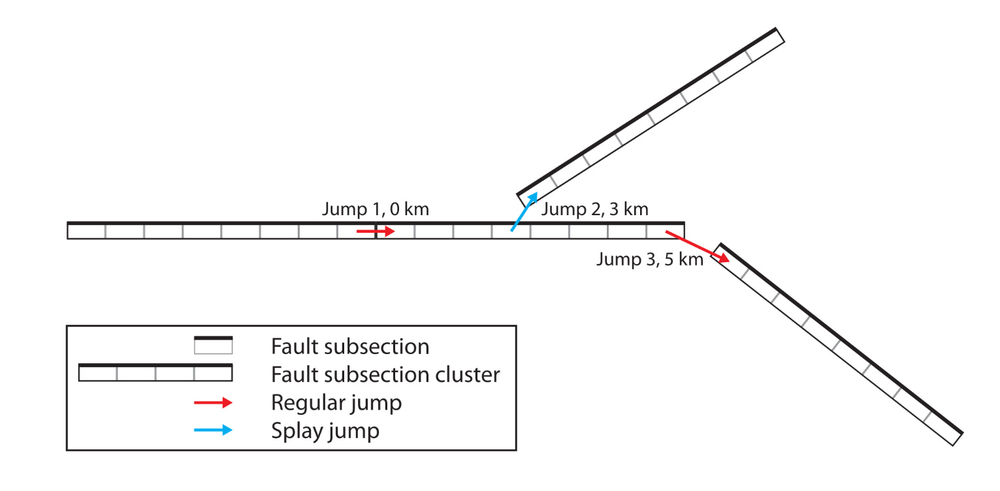

# Rupture Propagation
The rupture propagation problem is as follows:

> Given a set of faults known to be involved in a rupture and given we
> know the initial fault that ruptures, estimate the most likely order
> in which the subsequent faults rupture.

A rupture propagation algorithm is a required step in the SRF pipeline for a couple of reasons:

1. The slip generation algorithm that estimates both slip and initial rupture times
   across a fault (this is the job of the `genslip` binary) only works
   for a single connected fault. Consequently, we can only generate
   slip of faults independently (i.e. without information of
   neighbouring faults or when they rupture).
2. Because of (1), we must decide an order the faults rupture in for
   the SRF stitching process. *For a given set of faults, there is not
   always one obvious way the faults must rupture*.

The presence of an algorithm is especially important for simulation of
future events and automated simulation pipelines like Cybershake. Here
there is not a human in the loop deciding the rupture order, and so we
must guess it ourselves.

To explain the algorithm we use for multi-fault ruptures we first need
to introduce some theory. We then apply this theory to produce a
rupture propagation algorithm. There is probably no one correct
algorithm for this problem.

# Fault Jumping
In a multi-fault rupture, an initial fault may trigger a number of
subsequent faults. Though there may be a number of reasons why
ruptures might jump between faults there are three assumptions made in
the construction of the National Seismic Hazard Model (NSHM):

1. There are no _splay jumps_.
2. Jumping occurs between the closest points on two faults with a
   probability computed from these two closest points.
3. Each fault triggers at most one other fault.

A splay jump is a jump that does not occur between the end of one fault and the beginning of another.

The second assumption allows us to write our rupture propagation
algorithm from the geometry of the faults involved alone. It's
important to be aware of these assumptions in any custom scenarios.

The National Seismic Hazard Model follows the lead of Millner, Shaw, and Field (2022)[^1]. They do not
compute the rupture propagation information at any time, and simply
determine the set of faults involved (according to Oakley at GNS this
information is not available anywhere, and we truly have to work it out
ourselves).

The probability of jumping between two faults is given as a function of their closest-point distance $r$ by Shaw and Dieterich (2007)[^2] in Equation 3

$$p(r) = e^{-r/r_0},$$

where $r_0$ is an empirically determined value. We will use the value of $r_0 = 3$.
# Graphs, Probability and Spanning Trees
Suppose we have a rupture with three faults in the following configuration: 

We can define a jumping probability between each pair of faults,
$p(\mathrm{fault}_a, \mathrm{fault}_b)$, as the probability of jumping based on their
shortest distance (predicted by the Shaw-Dieterich model):

$$p(\mathrm{fault}_a, \mathrm{fault}_b) = e^{-\mathrm{distance}(\mathrm{fault}_a, \mathrm{fault}_b)/r_0}.$$

Notice that $p(\mathrm{fault}_a, \mathrm{fault}_b) = p(\mathrm{fault}_b, \mathrm{fault}_a)$ because the shortest
distance between fault a and fault b is the same as fault b to fault
a.

For the purposes of pruning highly unrealistic fault jumps, we can
define $p(\mathrm{fault}_a, \mathrm{fault}_b) = 0$ if the distance between fault a and
fault b is sufficiently large (in the code this cutoff is 15km). We
can visualise these probabilities using the edges in the picture
below.

The raw probabilities are not useful for rupture propagation. This is
because they compute the probability of jumping apriori, but we want
the probability of jumping from fault a to fault b *relative to the probability of jumping to other faults.* 

$$p(\mathrm{fault}_a, \mathrm{fault}_b\,|\, \text{jump from } \mathrm{fault}_a) = \frac{p(\mathrm{fault}_a, \mathrm{fault}_b)}{\sum_c p(\mathrm{fault}_a, \mathrm{fault}_c)}$$

We can update our picture now with this new probability
information, using arrows to indicate the relative probability of
jumping between faults. 

Note every pair of faults now has two arrows between them because
while the distance is the same, the relative probabilities depend on
connections to other faults (which breaks the earlier symmetry).

The fault geometry is no longer important to the problem, so we can
instead represent this as a _graph_. A graph is a set of nodes (the
faults in this case), and edges (the arrows). Edges may be weighted
(in this case by probabilities). Graphs are a very common tool in
mathematics and science, the reader is directed to any number of
textbooks on the topic for a proper treatment of graph theory.

With the graph in hand we can now talk about the likelihood of
_rupture scenarios_. We will define a _rupture scenario_ as any _path_
(sequence of edges) starting from an initial fault that reaches all
faults in the graph. A rupture scenario must be a path rather than a
_tree_ because of the 3rd assumption of the NSHM. Here are some
example rupture scenarios:

If we assume that fault jumping is independent, i.e. the probability
of jumping from fault b to c does not depend on the knowledge of how
we jumped to fault b, we can compute the probability of a rupture
scenario as the product of the chosen edges. So the first scenario
above has probability 0.17, whilst the second has probability 0.38. We
would therefore consider the second rupture scenario more likely than
the first.

In graph theory, we call a path that visit all nodes in a graph (what
we call rupture scenarios) a _Hamiltonian path_. Computing shortest
Hamiltonian paths in arbitrary graphs is a well-known NP-hard (very
difficult!) problem, but fortunately our faults tend to have
one plausible jump after pruning. Thus, greedy algorithms to compute
the Hamiltonian path will be close enough to the correct scenario
that exact computation is probably unnecessary. More complicated
heuristics, such as simulated annealing, are known to be robust even
in dense graphs and could be employed if the simulations become more complicated.

# Breaking the 3rd Assumption 
You'll notice in the rupture propagation module that there is no
mention of Hamiltonian paths anywhere. This is because we allow our
rupture scenarios to work under a weaker 3rd assumption

> 3. Each fault triggers an arbitrary number of faults. The
>    probability of jointly rupturing two faults is small.

With the 3rd assumption broken, rupture scenarios become trees, and
the most likely scenario is a minimum spanning tree rather than a
minimum Hamiltonian path. The intention is to eventually have both
algorithms implemented and allow users to select between the two. In
most cases in the NSHM, the minimum spanning tree is a minimum
Hamiltonian path. If we do not break this assumption, then the
initially selected fault cannot be between two other faults (as it
would need to then trigger the two faults on either side).

[^1]: Milner, K. R., Shaw, B. E., & Field, E. H. (2022). [Enumerating Plausible Multifault Ruptures in Complex Fault Systems with Physical Constraints](http://dx.doi.org/10.1785/0120210322). Bulletin of the Seismological Society of America, 112(4), 1806-1824.

[^2]: Shaw, B. E., & Dieterich, J. H. (2007). [Probabilities for jumping fault segment stepovers](https://doi.org/10.1029/2006GL027980). Geophysical Research Letters, 34(1).
